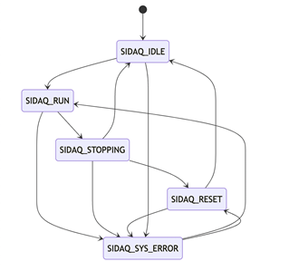
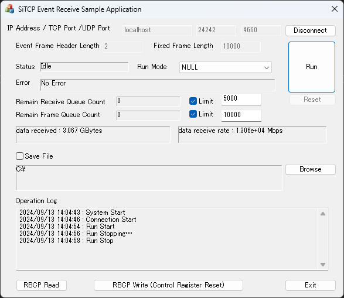
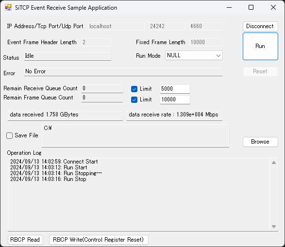

# SiDAQ-API

Read this in other languages: [English](README.md), [日本語](README.ja.md)

## 概要
WindowsアプリケーションでSiTCPデバイスと通信を行うためのAPIです。

### 機能
* SiTCPデバイスに対するDAQ実施
	* 測定の開始(SiTCPデバイスとのTCP接続開始)
		* イベントデータの取得	
	* 測定の終了(SiTCPデバイスとのTCP接続切断)
* RBCPプロトコルによるSiTCP内部レジスタの読み込み/書き込み

### 構造
* `SiDaqInitialize`を実行することで、SiTCP接続との通信を担う構造体SiDaqMngrが作成され、そのポインタを取得します。
* 上記の構造体に対してAPIを通じて処理を実行することで、DAQを実行します。

## 使用の流れ

### 初期化
* `SiDaqInitialize`を実行し、接続SiTCPデバイスのIPアドレス、TCPポート番号、UDPポート番号を与えて初期化します。
	* 初期化時に接続テストとしてUDP通信が実行されます。
* 返ってきた構造体のポインタは、アプリケーション側で管理してください。

### 測定開始
* `SiDaqRun`を実行すると、SiTCPとのTCP接続が実行されます。
	* 受信データがフレーミングされ、イベントキューに格納されます。
* 引数にフレーム長取得関数のポインタを渡すことで、フレーミング処理が実行されます。
	* 引数がないとき、またはNULLを渡している場合は、受信データがそのままの長さでイベントキューに格納されます。
### データ取得
* `SiDaqGetData`を実行すると、イベントキューからイベントデータを1つ取得します。
	* 取得後は、必ず`SiDaqDeleteData`でデータを解放してください。

### 測定終了
* `SiDaqStop`を実行すると、SiTCPとのTCP接続が終了します。
	* その時点までの受信データはすべてフレーミングされ、イベントキューに格納されます。
	* イベントキューのデータは削除されません。`SiDaqStop`実行後も、`SiDaqGetData`で取得できます。

### 終了
* `SiDaqTerminate`を実行することで、`SiDaqInitialize`で確保されたすべてのリソースが解放されます。必ず実行してください。

## 内部状態
`SiDaqGetStatus`で、現在のAPI内部状態が取得できます。
* APIでは、`SiDaqStatus`列挙型として、下記の状態が`SiDaqApi.h`で定義されています。

* SIDAQ_IDLE
	* 正常に初期化された状態です。
		* `SiDaqRun`によって、`SIDAQ_RUN`に遷移します。
* SIDAQ_RUN
	* デバイスとTCP接続され、イベントデータ受信中の状態です。
		* `SiDaqStop`によって、`SIDAQ_STOPPING`に遷移します。
* SIDAQ_STOPPING
	* `SiDaqStop`が呼ばれてTCP接続が切断され、残っている受信データをフレーミングしている状態です。
		* フレーミング終了後、`SIDAQ_IDLE`に遷移します。
* SIDAQ_RESET
	* `SIDAQ_STOPPING`の状態で`SiDaqResetQueue`が呼ばれた場合に遷移します。
	* Queueに記録されたデータをすべて削除します。
	* 削除完了後、`SIDAQ_IDLE`または`SIDAQ_SYS_ERROR`に遷移します
		* 内部エラーによって`SIDAQ_STOPPING`に遷移していた場合に、`SIDAQ_SYS_ERROR`に遷移します。
* SIDAQ_SYS_ERROR
	* 処理中にエラーが発生した場合、TCP接続は切断され、この状態に遷移します。
	* `SiDaqRun`を実行可能です。
	* `SiDaqErrorMessage`で、エラーメッセージを取得できます。
	* `SiDaqGetSockErrorCode`で、Windowsソケットのエラーコードを取得できます。
* SIDAQ_INVALID_MNGR
	* 適切でないポインタを`SiDaqGetStatus`に渡して実行したときに返る状態です。

## API
### SiDaqInitialize
* SiTCPと通信を行う構造体を作成し、初期化します。
* 引数
	* IPアドレス
	* TCPポート番号
	* UDPポート番号
	* not_wsa_cleanup(アプリケーションが別にネットワークを初期化、管理している場合は TRUE)
* 戻り値
	* 作成されたマネージャー構造体ポインタ
* 備考
	* この関数ではTCP接続は実行されません。
	* 接続テストとして、UDP通信でSiTCPの内部レジスタを読み取ります。

### SiDaqTerminate
* `SiDaqInitialize`で作成されたマネージャを解放します
* 引数
	* 対象のマネージャー構造体ポインタ
* 戻り値
	* なし
* 備考
	* `SiDaqStop`が同時に実行されます。
	* `SiDaqInitialize`で確保されたリソースは、この関数でのみ解放されます。

### SiDaqRun
* デバイスとTCP接続を開始し、データの受信及びフレーミングを開始します。
* 引数
	* 対象のマネージャー構造体ポインタ
	* フレーム長算出関数ポインタ
		* フレーム長算出関数ポインタには、受信データ列(unsigned char*)、受信データ長(unsigned int)、ヘッダ長(unsigned int)を引数にとり、対象データのフレーム長(int)を返す関数を渡してください。
		* 渡される受信データ列の先頭は、常にイベントデータの先頭となっています。
		* 返すべきフレーム長は、イベントデータからヘッダ長を引いた値としてください。
		* フレーム長算出に失敗した場合は、-1を返してください。
		* 関数の定義は、サンプルプログラムを参考にしてください。
			* C++ で使用する場合は、`MfcSample/SiDaqMfcSampleDlg.cpp`の`GetFrameLength`関数を参考にしてください。
			* C# で使用する場合は、`CsSample/SiDaqConnect.cs`の`GetHeaderLengthFuncSample`関数および`CsSample/SiDaqApi.cs`の`LengthFunc`デリゲート定義を参考にしてください。
		* 関数ポインタとしてNULLを渡した場合は、常に受信データ長=フレーム長として処理します。
	* ヘッダ長
		* 受信データのフレーム長を算出するために必要なヘッダ長さ(単位：byte)を渡してください。
	* 固定フレーム長
		* この引数が0(既定値)以外の値の場合、フレーミングはすべてここで指定したフレーム長(単位：byte)で処理されます。
			* フレーム長算出関数は実行されません。
	* 受信バッファサイズ
		* アプリケーションを動作させるPCの受信バッファを設定します(単位：byte)
		* 既定値は-1です。この場合、受信バッファ設定処理は実行されません。
		* 環境に合わせて設定してください。
	* 受信データキュー上限値
		* この引数が0(既定値)以外の場合、受信データキューの個数が指定した値を上回った場合、`SIDAQ_SYS_ERROR`となり測定が終了します。
	* イベントキュー上限値
		* この引数が0(既定値)以外の場合、イベントキューの個数が指定した値を上回った場合、`SIDAQ_SYS_ERROR`となり測定が終了します。
	* ソケット受信バッファサイズ
		* TCP受信のバッファサイズを指定できます。(既定値：65536*4) (単位：byte)
	* 最大フレーム長
		* 最大フレーム長を指定できます。(既定値：262144) (単位：byte)
* 戻り値
	* マネージャのステータス
* 備考

### SiDaqStop
* デバイスとTCP接続を終了します。
* 引数
	* 対象のマネージャー構造体ポインタ
* 戻り値
	* true:停止完了、false:停止失敗
* 備考
	* 終了した時点で受信されたデータはすべてフレーミングされ、イベントキューに格納されます。
		* Runしていない状態でも、`SiDaqGetData`によって取得可能です。

### SiDaqGetData
* イベントキューに格納されたデータを1つ取得します。
* 引数
	* 対象のマネージャー構造体ポインタ
	* 取得したデータ長ポインタ
	* wait_msec 負の値はデータ取得まで、正の値は指定されたミリ秒待つ
* 戻り値
	* データの先頭ポインタ
* 備考
	* データ取得後は、必ず`SiDaqDeleteData`を呼び、データを解放してください。

### SiDaqDeleteData
* イベントキューに格納されたデータを解放します。
* 引数
	* 対象のマネージャー構造体ポインタ
	* `SiDaqGetData`で取得したデータ
* 戻り値
	* なし
* 備考

### SiDaqResetQueue
* 受信データキュー、イベントキューに格納されたデータをすべて削除します。
* 引数
	* 対象のマネージャー構造体ポインタ
* 戻り値
	* なし
* 備考
	* `SiDaqStop`で`SIDAQ_STOPPING`に遷移している状態、または`SIDAQ_SYS_ERROR`で測定が停止している状態のみ実行可能です。

### SiDaqGetDataCount
* TCP接続で受信した、フレーミングされていないデータの総数を取得します。
* 引数
	* 対象のマネージャー構造体ポインタ
* 戻り値
	* 受信データキューに格納されたデータの総数
* 備考
	* 受信データキュー：SiTCPデバイスから受信し、フレーミング処理が完了していないデータを格納するキューです。

### SiDaqGetFrameDataCount
* フレーミングされたイベントデータの総数を取得します。
* 引数
	* 対象のマネージャー構造体ポインタ
* 戻り値
	* イベントキューに格納されたデータの総数
* 備考
	* `SiDaqGetData`で取得するイベントキューに格納されているデータの総数です。

### SiDaqGetStatus
* 現在の状態を取得します。
* 引数
	* 対象のマネージャー構造体ポインタ
* 戻り値
	* マネージャーのステータス
* 備考
	* 列挙型`SiDaqStatus`です。

### SiDaqStatusText
* 現在の状態を文字列で取得します。
* 引数
	* 対象のマネージャー構造体ポインタ
* 戻り値
	* マネージャーのステータス文字列
* 備考

### SiDaqErrorMessage
* 最新のエラーメッセージを取得します。
* 引数
	* 対象のマネージャー構造体ポインタ
* 戻り値
	* エラーメッセージ文字列
* 備考

### SiDaqGetSocketErrorCode
* 最新のWindowsソケット エラーコードを取得します。
* 引数
	* 対象のマネージャー構造体ポインタ
* 戻り値
	* エラーコード
* 備考
	* `WSAGetLastError(winsock2.h)`で取得されたエラーコードです。 

### SiDaqRbcpReadBytes
* RBCP通信でSiTCP内部レジスタの値を読み取ります。
* 引数
	* 対象のマネージャー構造体ポインタ
	* 読み取る先頭アドレス
	* 読み取る長さ
* 戻り値
	* 読み取り内容
		* NULLの場合、読み取り失敗。`SiDaqErrorMessage`で情報が取得できます。
* 備考

### SiDaqRbcpWriteBytes
* RBCP通信でSiTCP内部レジスタに値を書き込みます。
* 引数
	* 対象のマネージャー構造体ポインタ
	* 書き込むバイト列のポインタ(unsigned char*)
	* 書き込む先頭アドレス
	* 書き込むデータ長
* 戻り値
	* 0:成功
		* -1の場合、書き込み失敗。`SiDaqErrorMessage`で情報が取得できます。
* 備考

### SiDaqPauseRecvData
* TCPデータ受信を一時停止します。
* 引数
	* 対象のマネージャー構造体ポインタ
* 戻り値
	* なし
* 備考
	* ソケット受信処理のみ一時停止します(測定は継続します)	

### SiDaqResumeRecvData
* TCPデータ受信を再開します。
* 引数
	* 対象のマネージャー構造体ポインタ
* 戻り値
	* なし
* 備考
	* `SiDaqPauseRecvData`で一時停止した受信を再開します。

## サンプルプログラム
本APIを使用してSiTCPデバイスに接続し、DAQを行うサンプルプログラムを用意しています。API使用例としてご確認ください。
* C++(MFC)およびC#(Forms)のサンプルプログラムを用意しています。
	* 両サンプルプログラムのGUI構成はほぼ同一です。
	* リポジトリにはそれぞれのVisual Studioプロジェクトファイルが含まれています。ビルドする場合は、プラットフォームを`x64`に指定してください。
* また、接続先のサンプルとして、SiTCP疑似デバイス(Python)を用意しています。

## MfcSample
* C++ MFCアプリケーションでSiTCPデバイスのデータを受信するサンプルプログラムです。

## CsSample
* C# FormsアプリケーションでSiTCPデバイスのデータを受信するサンプルプログラムです。
	* C#アプリケーションからは、C++ DLLを呼び出すラッパークラスを定義してAPIを使用します。

### コントロール説明
* IP Address / TCP Port / UDP Port 入力欄
	* 接続するSiTCPデバイスの各種情報を入力します。
* Connect/Disconnectボタン
	* SiTCPデバイスとの接続/切断を実行します。
	* UDP通信で接続確認が実施されます。
	* `SiDaqInitialize/SiDaqTerminate`が実行されます。
* Event Frame Header Length入力欄
	* Run Mode：HeaderでRunを実行する場合の、ヘッダbyte長を入力します。
	* `SiDaqRun`に与える引数`header_len`に対応します。
* Fixed Frame Length入力欄
	* Run Mode：FixedでRunを実行する場合の、フレームbyte長を入力します。
	* `SiDaqRun`に与える引数`fixed_frame_len`に対応します。
* Status表示欄
	* SiTCPデバイスのStatusが表示されます。
	* `SiDaqStatusText`で情報を取得しています。
* Run Mode選択コンボボックス
	* Runを実行する際の、フレーミング処理を指定します。
	* `SiDaqRun`に与える引数`LengthFunc`に対応します。
		* NULL：受信データをフレーミングしません。
		* Header：受信データの先頭をデータ長が格納されたヘッダとして、フレーミングを実施します。
		* Fixed：固定長でフレーミングを実施します。
* Error表示欄
	* SiTCPデバイスのError情報が表示されます。
	* `SiDaqErrorMessage`で情報を取得しています。
* Run/Stopボタン
	* SiTCPデバイスとTCP通信を接続/切断し、測定を開始/終了します。
	* `SiDaqRun/SiDaqStop`が実行されます。
* Remain Receive Queue Count表示欄
	* 受信データキューのデータ個数が表示されます。
		* SiTCPデバイスから受信した、フレーミング処理前のデータが格納されているキューです。
		* `SiDaqGetDataCount`でデータ数を取得しています。
* Remain Receive Queue Count Limitチェックボックス
	* チェックしている場合、受信データキューのデータ個数が上限値を上回ると、Runが自動停止します。
* Remain Receive Queue Count Limit値入力欄
	* 受信データキューのデータ上限値を入力します。
* Remain Frame Queue Count表示欄
	* イベントキューのデータ個数が表示されます。
		* 受信データキューのデータをフレーミングした結果が格納されるキューです。
		* `SiDaqGetFrameDataCount`でデータ数を取得しています。
		* サンプルプログラムは、`SiDaqGetData`でこのキューからデータを取得し、`SiDaqDeleteData`でデータを削除します。
* Remain Frame Queue Count Limitチェックボックス
	* チェックしている場合、イベントキューのデータ個数が上限値を上回ると、Runが自動停止します。
* Remain Frame Queue Count Limit値入力欄
	* イベントキューのデータ上限値を入力します。
* 受信データサイズ表示欄
	* 測定中に受信したデータの合計値が表示されます。
* 受信レート表示欄
	* 測定中の受信データレートが表示されます。
* Resetボタン
	* 受信データキューとイベントキューに格納されたデータをすべて削除します。
	* Stopボタンによる測定停止、または内部エラーによる測定停止中に実行可能です。
	* `SiDaqResetQueue`が実行されます。
* Save Fileチェックボックス
	* チェックしている場合、受信データをファイルに保存します。
		* ファイル書き込み中はデータ受信を一時停止します。
		* `SiDaqPauseRecvData,SiDaqResumeRecvData`が実行されます。
* ファイルパス表示欄
	* 受信データ書き込みファイルを保存するディレクトリパスが表示されます。
* Browseボタン
	* 受信データ書き込みファイルを保存するディレクトリパスを指定するダイアログを表示します。
* Operation Log表示欄
	* 操作ログが表示されます。
* RBCP Readボタン
	* SiTCPデバイスに対してRBCP通信(読み込み)を実施します。
	* SiTCPレジスタ空間のデータを読み取り、Operation Logに表示します。
	* `SiDaqRbcpReadBytes`が実行されます。
* RBCP Write(Control Register Reset)ボタン
	* SiTCPデバイスに対してRBCP通信(書き込み)を実施します。
	* SiTCPデバイスのControl Register bit7に1を書き込みます。
		* SiTCPデバイスがリセットされます。
	* `SiDaqRbcpWriteBytes`が実行されます。

## Pseudo
* サンプルプログラムと接続してデータを送信するためのSiTCP疑似デバイス(Python)です。
	* 詳細は個別のREADMEを参照してください。[English](Pseudo/README.md), [日本語](Pseudo/README.ja.md)