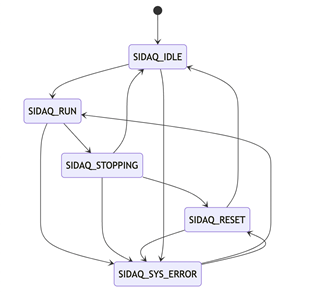
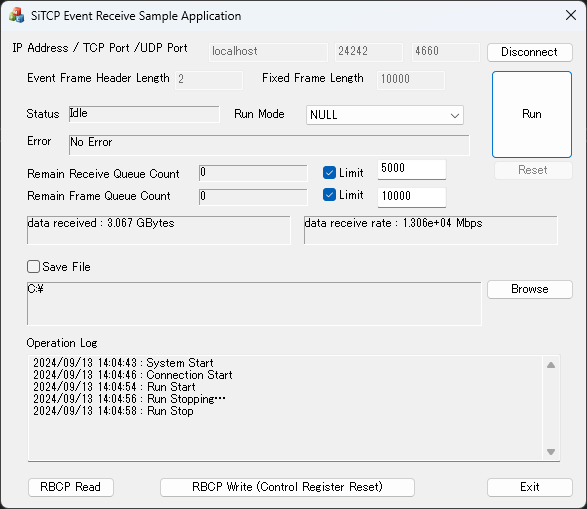
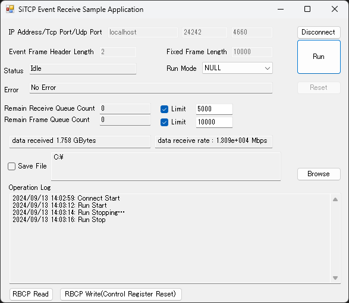

# SiDAQ-API

Read this in other languages: [English](README.md), [日本語](README.ja.md)

## Overview
This is an API for communicating with SiTCP devices in Windows applications.

### Functions
* DAQ for SiTCP devices
	* Start measurement (start TCP connection with SiTCP device)
		* Get event data
	* End measurement (end TCP connection with SiTCP device)
* Read/write SiTCP internal registers using RBCP protocol

### structure
* Execute `SiDaqInitialize` to create a struct SiDaqMngr that handles communication with SiTCP device, and obtain its pointer.
* DAQ by executing processing on the above struct through API.

## Usage

### Initialization
* Execute `SiDaqInitialize` and initialize by giving the IP address, TCP port number, and UDP port number of the connected SiTCP device.
	* UDP communication is executed as a connection test during initialization.
* The pointer to the struct should be managed by user application.

### Start measurement
* Executing `SiDaqRun` executes a TCP connection with SiTCP.
	* The received data is framed and stored in the event queue.
* The framing process is executed by passing a pointer to the frame length calculation function as an argument.
	* If there is no argument or NULL is passed, the received data is stored in the event queue with its original length.
### Get data
* Executing `SiDaqGetData` gets one event data from the event queue.
	* After `SiDaqGetData`, be sure to execute `SiDaqDeleteData` to release the data.

### End measurement
* Executing `SiDaqStop` stops the TCP connection with SiTCP.
	* All received data is framed and stored in the event queue.
	* The data in the event queue is not deleted. You can still get data by `SiDaqGetData`. even after `SiDaqStop`.

### Termination
* `SiDaqTerminate` releases all resources allocated by `SiDaqInitialize`. Be sure to run it.

## Internal state
The current API internal state can be obtained with `SiDaqGetStatus`.

* In this API, the following states are defined in `SiDaqApi.h` as the `SiDaqStatus` enumeration type.

* SIDAQ_IDLE
	* Successfully initialized.
		* Transitions to `SIDAQ_RUN` by `SiDaqRun`.
* SIDAQ_RUN
	* A TCP connection has been established with the device, and event data is being received.
		* Transitions to `SIDAQ_STOPPING` by `SiDaqStop`.
* SIDAQ_STOPPING
	* `SiDaqStop` has been called, the TCP connection has been disconnected, and the remaining received data is being framed.
		* Transitions to `SIDAQ_IDLE` after framing has finished.
* SIDAQ_RESET
	* This state occurs when `SiDaqResetQueue` is called in `SIDAQ_STOPPING`.
	* All data stored in the queue is deleted.
	* Once deletion is complete, the state transitions to `SIDAQ_IDLE` or `SIDAQ_SYS_ERROR`.
		* If the state transitioned to `SIDAQ_STOPPING` due to an internal error, the state transitions to `SIDAQ_SYS_ERROR`.
* SIDAQ_SYS_ERROR
	* An error occurred during processing. The TCP connection has been closed.
	* `SiDaqRun` can be executed.
	* An error message can be obtained with `SiDaqErrorMessage`.
	* A Windows socket error code can be obtained with `SiDaqGetSockErrorCode`.
* SIDAQ_INVALID_MNGR
	* This state is returned when an invalid pointer is passed to `SiDaqGetStatus` and executed.

## API
### SiDaqInitialize
* Creates and initializes a struct for communicating with SiTCP.
* Arguments
	* IP address
	* TCP port number
	* UDP port number
	* not_wsa_cleanup(TRUE : Do not run WSAStartup() on this API.)
* Return value
	* Pointer to the manager struct
* Remarks
	* This function does not establish a TCP connection.
	* As a connection test, the internal registers of SiTCP are read with UDP communication.

### SiDaqTerminate
* Releases the manager created by `SiDaqInitialize`
* Arguments
	* Pointer to target manager struct
* Return value
	* None
* Remarks
	* `SiDaqStop` is executed at the same time.
	* Resources allocated by `SiDaqInitialize` are only released by this function.

### SiDaqRun
* Establishes a TCP connection with the device and begins receiving and framing data.
* Arguments
	* Pointer to target manager struct
	* Pointer to frame length calculation function
		* For the frame length calculation function takes the received data string (unsigned char*), received data length (unsigned int), and header length (unsigned int) as arguments and returns the frame length (int) of the target data.
		* The beginning of the received data string passed is always the beginning of the event data.
		* The frame length returned by the function should be the event data minus the header length.
		* If frame length calculation fails, return -1.
		* For function definitions, please refer to the sample programs.
			* About C++, please refer to the `GetFrameLength` function in `MfcSample/SiDaqMfcSampleDlg.cpp`.
			* About C#, please refer to the `GetHeaderLengthFuncSample` function in `CsSample/SiDaqConnect.cs` and the `LengthFunc` delegate definition in `CsSample/SiDaqApi.cs`.
		* If NULL is passed as the function pointer, it will always be processed assuming that the received data length = frame length.
	* Header length
		* The header length (unit: byte) required to calculate the frame length of the received data.
	* Fixed frame length
		* If this argument is a value other than 0 (the default), all framing will be done with the specified frame length (unit: bytes).
			* The frame length calculation function will not be executed.
	* Receive buffer size
		* Set the receive buffer of the PC running the application (unit: byte).
		* The default value is -1, which means no receive buffer setup process is performed.
		* Set according to your PC environment.
	* Receive data queue upper limit
		* If this argument is a value other than 0 (default), if the number of receive data queues exceeds the specified value, `SIDAQ_SYS_ERROR` will occur and the measurement will end.
	* Event queue upper limit
		* If this argument is a value other than 0 (default), if the number of event queues exceeds the specified value, `SIDAQ_SYS_ERROR` will occur and the measurement will end.
	* Socket receive buffer size
		* You can specify the TCP receive buffer size. (Default: 65536*4) (Unit: byte)
	* Maximum frame length
		* You can specify the maximum frame length. (Default: 262144) (Unit: byte)
* Return value
	* Manager status
* Remarks

### SiDaqStop
* End the TCP connection with the device.
* Arguments
	* Pointer to target manager struct
* Return value
	* TRUE: Stop completed, False: Stop failed
* Remarks
	* All data received is framed and stored in the event queue.
		* you can get data by `SiDaqGetData` even when not running.

### SiDaqGetData
* Get one event data stored in the event queue.
* Arguments
	* Pointer to target manager struct
	* Pointer to  data length
	* wait_msec Positive: wait for specified (millisecondes). Negative:wait until data is obtained. 
* Return value
	* Pointer to data
* Remarks
	* After getting data, be sure to call `SiDaqDeleteData` to release the data.

### SiDaqDeleteData
* Releases data obtained in the event queue.
* Arguments
	* Pointer to target manager struct
	* Pointer to data obtained with `SiDaqGetData`
* Return value
	* None
* Remarks

### SiDaqResetQueue
* Deletes all data stored in the receive data queue and event queue.
* Arguments
	* Pointer to target manager struct
* Return value
	* None
* Remarks
	* This API can only be executed when the state has transitioned to `SIDAQ_STOPPING` with `SiDaqStop` or when running has stopped with `SIDAQ_SYS_ERROR`.

### SiDaqGetDataCount
* Get number of data queues before framing
* Arguments
	* Pointer to target manager struct
* Return value
	* Number of data
* Remarks
	* Receive data queue: A queue that stores data received from SiTCP devices that has not yet completed framing.

### SiDaqGetFrameDataCount
* Get number of data queues after framing
* Argument
	* Pointer to target manager struct
* Return value
	* Number of data
* Remarks
	* The total number of data stored in the event queue that can be obtained by `SiDaqGetData`.

### SiDaqGetStatus
* Gets the current status.
* Argument
	* Pointer to target manager struct
* Return value
	* Current anager status
* Remarks
	* Enumeration type `SiDaqStatus`.

### SiDaqStatusText
* Gets the current status as a string.
* Argument
	* Pointer to target manager struct
* Return value
	* Current manager status string
* Remarks

### SiDaqErrorMessage
* Gets the latest error message.
* Argument
	* Pointer to target manager struct
* Return value
	* Error message string
* Remarks

### SiDaqGetSocketErrorCode
* Gets the latest Windows socket error code.
* Arguments
	* Pointer to target manager struct
* Return value
	* Windows Socket error code
* Remarks
	* Error code obtained by `WSAGetLastError(winsock2.h)`.

### SiDaqRbcpReadBytes
* Reads the value of the SiTCP internal register via RBCP communication.
* Arguments
	* Pointer to target manager struct
	* Head address to be read
	* Length of data to be read
* Return value
	* Result of reading
		* If NULL, reading fails. Information can be obtained with `SiDaqErrorMessage`.
* Remarks

### SiDaqRbcpWriteBytes
* Writes a value to the SiTCP internal register via RBCP communication.
* Arguments
	* Pointer to target manager struct
	* Pointer to byte data to write to (unsigned char*)
	* Head address to write to
	* Length of data to write to
* Return value
	* 0: Success
		* If -1, writing fails. Error message can be obtained with `SiDaqErrorMessage`.
* Remarks

### SiDaqPauseRecvData
* Pauses TCP data receive processing.
* Arguments
	* Pointer to target manager struct
* Return value
	* None
* Remarks
	* Pauses only socket receive processing (measurement continues)

### SiDaqResumeRecvData
* Resumes TCP data receive processing
* Arguments
	* Pointer to target manager struct
* Return value
	* None
* Remarks
	* Resumes socket receive processing paused with `SiDaqPauseRecvData`.

## Sample Program
A sample program is available that uses this API to connect to a SiTCP device and DAQ. Please check it as an example of how to use this API.
* Sample programs are available in C++ (MFC) and C# (Forms).
	* The GUI of both sample programs are almost identical.
	* The repository includes the respective Visual Studio project files. When building, specify the platform as `x64`.
* In addition, a SiTCP pseudo device (Python) is provided as a sample connection destination.

## MfcSample
* A sample program that receives data from a SiTCP device. (C++ MFC application)

## CsSample
* A sample program that receives data from a SiTCP device. (C# Forms application)
	* Define a wrapper class that calls a C++ DLL and use this API.

### Control Description
* IP Address / TCP Port / UDP Port input field
	* Enter parameters about the SiTCP device to be connected.
* Connect/Disconnect button
	* Executes connect/disconnect to the SiTCP device.
* Connection is cheked by UDP Communication.
* `SiDaqInitialize/SiDaqTerminate` is executed.
* Event Frame Header Length input field
	* Enter the header byte length when executing a Run in (Run Mode: Header).
	* argument `header_len` given to `SiDaqRun`.
* Fixed Frame Length input field
	* Enter the frame length in bytes when executing a Run in (Run Mode: Fixed).
	* argument `fixed_frame_len` given to `SiDaqRun`.
* Status display field
	* Displays the status of the SiTCP device.
	* Status text is obtained from `SiDaqStatusText`.
* Run Mode selection combo box
	* Specifies the framing process when executing Run.
	* argument `LengthFunc` given to `SiDaqRun`.
		* NULL: No framing received data.
		* Header: Framing by using the beginning of the received data as a header that stores the data length.
		* Fixed: Framing by fixed length.
* Error display field
	* Displays error information for the SiTCP device.
	* Error message is obtained by `SiDaqErrorMessage`.
* Run/Stop button
	* Connect/disconnect TCP communication with the SiTCP device and starts/ends measurement.
	* Executes `SiDaqRun/SiDaqStop`.
* Remain Receive Queue Count display field
	* Displays the number of data in the receive data queue.
		* This is the queue that stores data received from the SiTCP device before framing processing.
		* The number of data is obtained by `SiDaqGetDataCount`.
* Remain Receive Queue Count Limit checkbox
	* If checked, Run will automatically stop when the number of data in the receive data queue exceeds the upper limit.
* Remain Receive Queue Count Limit value input field
	* Enter the upper limit of the receive data queue.
* Remain Frame Queue Count display field
	* Displays the number of data in the event queue.
		* This is the queue that stores framing the data in the receive data queue.
		* The number of data is obtained by `SiDaqGetFrameDataCount`.
		* The sample program obtains data from this queue by `SiDaqGetData` and deletes data by `SiDaqDeleteData`.
* Remain Frame Queue Count Limit checkbox
	* If checked, Run will automatically stop when the number of data in the event data queue exceeds the upper limit.
* Remain Frame Queue Count Limit value input field
	* Enter the upper limit of the event data queue.
* Received data size display field
	* Displays the total amount of data received during measurement.
* Received rate display field
	* Displays the received data rate during measurement.
* Reset button
	* Deletes all data stored in the receive data queue and event queue.
	* This can be executed when running is stopped by pressing the Stop button or due to an internal error.
	* Executes `SiDaqResetQueue`.
* Save File checkbox
	* If checked, the received data is saved to a file.
		* Data receive processing is paused while writing to a file.
		* `SiDaqPauseRecvData,SiDaqResumeRecvData` are executed.
* File path display field
	* Displays the directory path where the received data write file is saved.
* Browse button
	* Displays a dialog box for specifying the directory path where the received data write file is saved.
* Operation Log display field
	* Displays the operation log.
* RBCP Read button
	* RBCP communication (read) to the SiTCP device.
	* Reads data from the SiTCP register space and displays it in the Operation Log.
	* Executes `SiDaqRbcpReadBytes`.
* RBCP Write (Control Register Reset) button
	* RBCP communication (write) to the SiTCP device.
	* Writes 1 to the Control Register bit7 of the SiTCP device.
		* Resets the SiTCP device.
	* Executes `SiDaqRbcpWriteBytes`.

## Pseudo
* A SiTCP pseudo device (Python) for connecting to the sample program and sending data.
	* Please read the README for details. [English](Pseudo/README.md), [日本語](Pseudo/README.ja.md)